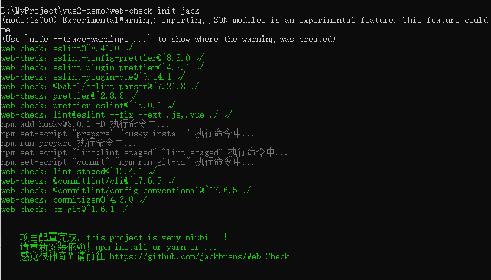

# Web-Check

初始化项目的规范构建，自动帮助项目安装 eslint、prettier、husky、commitzen 等工具。

值得一提的是：**使用该插件生成配置文件时，会对项目造成破坏性的变更，例如原本有eslint或者prettier配置，也会被强行覆盖，建议在项目初期或者小型的项目中使用。**





# 踩坑合集

## 项目默认不支持 ES module，需要安装 babel 插件来编译

操作步骤：

- `npm install -D @babel/core @babel/preset-env`   安装依赖

- 根目录下新建 `.babelrc` 文件，添加 `babel` 预设

  - ```js
    // .babelrc 文件内容
    {
      "presets": ["@babel/preset-env"]
    }
    ```

- 在 `package.json` 中添加字段 `"type": "module"`，因为 `node` 默认是 `CommonJS` 模块管理的


## import 引入 json 文件时报错

```js
// 错误 ❎
import packJson from "../package.json"

// 正确 ✅
import packJson from "../package.json" assert { type: "json" }
```


## 写入文件除了用 outputFileSync ，还有哪些，分别有什么好处？

```js
const getPath = (paths) => {
  return path.join(process.cwd(), paths)
}


fs.outputFileSync(getPath('./.eslintrc.js'), eslintrc)
fs.outputFileSync(getPath('./.eslintignore'), eslintignore)
```


## 使用 cross-spawn 无法执行 npx 命令

解决办法：

因为使用 `cross-spawn` 无法使用 `npx` 命令，所以可以在 `package.json` 的 `scripts` 中添加命令，然后用 `npm` 执行他

```json
import spawn from "cross-spawn"

spawn.sync(`npm set-script "prepare" "husky install"`)
spawn.sync(`npm run prepare`)
```

**这里出现的问题是 husky 无法安装，因为cross-spawn 不支持 npx 命令，我们只是将它添加到 package.json 而已， 所以我们可以用 npm 代替执行**


# 多版本差异化配置（开发进度）

- vue2
  - 默认是vue2 :white_check_mark:
- vue3
  - 项目是否支持 typescript ？:white_check_mark:
  - 项目是否支持 vite ？
- nuxt2
- nuxt3
- react
-  more....

